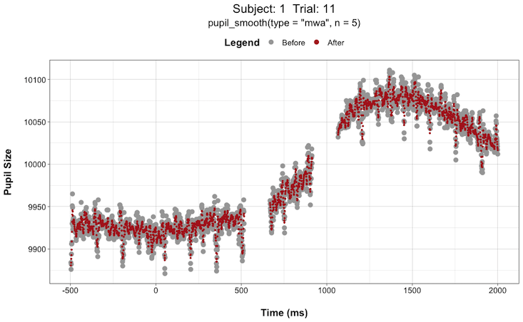

# pupillometry 

> An R Package to preprocess pupil data

This package contains various functions for different steps in the preprocessing pipeline for pupil data. The preprocessing steps are based on current standards such as:

- deblinking

- artifact rejection (e.g., MAD)

- smoothing (low-pass filter)

- interpolation

- baseline correction

```r
data_pupil <- pupil_read("folder/file.csv", eyetracker = "eyelink") %>%
  pupil_deblink(extend = 75) %>%
  pupil_artifact(n = 16) %>%
  pupil_smooth(type = "mwa", n = 51) %>%
  pupil_interpolate(type = "linear") %>%
  pupil_baselinecorrect(bc_onset_message = "Stimulus_Onset")
```

This package was developed for ease-of-use for researchers that are not experts in either pupillometry or working with data in R. The preprocessing steps can easily be implemented using the pipe operator `%>%` and a code template is provided: [Preprocessing Code (Template)](https://dr-jt.github.io/pupillometry/articles/preprocess_overview.html) in which preprocessing steps can be modified and/or removed.

## Eyetracker Support

The format and organization of the raw data file will depend on the type of eye tracker used. This package supports a few eye trackers for easy import. However, any eye tracker data file can be imported by specifying column names.

The `pupil_read()` function imports the messy raw data file and its output is a tidy raw data file with standardized column names and value labels to be used by the other functions in this package.

Currently, `pupil_read()` supports:

- SensoMotoric Instruments (SMI) eye trackers: `eyetracker = "smi"`

    -   RED250m

    -   Eye glasses

- SR Research EyeLink100 eye trackers: `eyetracker = "eyelink"`

- Tobii eye trackers: `eyetracker = "tobii"`

- Any eye tracker data file: `eyetracker = ""`

    - Need to specify column names for certain variables. See `pupil_read()`

## Visualize Before and After

It can be challenging to decide what preprocessing steps and parameters to use and how the different options might impact the quality of your data. Even if you go with what other researchers have previously used, it is still a bit of black box when it comes to understanding how your raw pupil data is being transformed and if there are any unintended consequences. 

This is not an easy problem to solve as collecting physiological measures, like pupil size, involves a large amount of data per individual subject. 

To add more transparency to this process, this package includes the option to plot the pupil data before and after each preprocessing step, as a comparison. This package preprocesses the data on a trial-by-trial basis (not on the entire data). Therefore, a plot of every trial (for one subject) will be produced or alternatively a plot of only specified trials will be produced. It is not feasible to inspect every trial plot for every subject; however, it is encouraged to inspect a variety of plots with different noisy characteristics to best understand how your preprocessing decisions impact different pupil wave-forms. 

You can specify plots to be produced using the `plot = TRUE` and `plot_trial = c()` arguments:

```r
data_pupil <- pupil_read("folder/file.csv", eyetracker = "eyelink") %>%
  pupil_deblink(extend = 75, plot = TRUE, plot_trial = c(1,2,3,4,5)) %>%
  pupil_artifact(n = 16, plot = TRUE, plot_trial = c(1,2,3,4,5)) %>%
  pupil_smooth(type = "mwa", n = 51, plot = TRUE, plot_trial = c(1,2,3,4,5)) %>%
  pupil_interpolate(type = "linear", plot = TRUE, plot_trial = c(1,2,3,4,5))
```

This can be extremely helpful when deciding things like "how large of a window size should I use when smoothing the data?". You can try different window sizes and plot the before and after each time until you find a window size that is not too large as to get rid of any meaningful signals but not too small such that there is still too much high-frequency noise in the data. 

For instance, here are plots for Subject 1 on Trial 11 with a smoothing window (n) of 5 vs. 51:




    
## Install

``` r
devtools::install_github("dr-JT/pupillometry")
```

## Support

If you are having difficulty getting the package to work or would like to make a feature request then do not hesitate to contact me: [jason.tsukahara\@gatech.edu](mailto:jason.tsukahara@gatech.edu)

## Citation

[](https://zenodo.org/badge/latestdoi/146345641)

> Tsukahara, J.S. (2022). pupillometry: An R package to preprocess pupil data (v0.8.1). <http://10.5281/zenodo.4464853>

[See Changelog for citations of previous versions](https://dr-jt.github.io/pupillometry/news/index.html)
